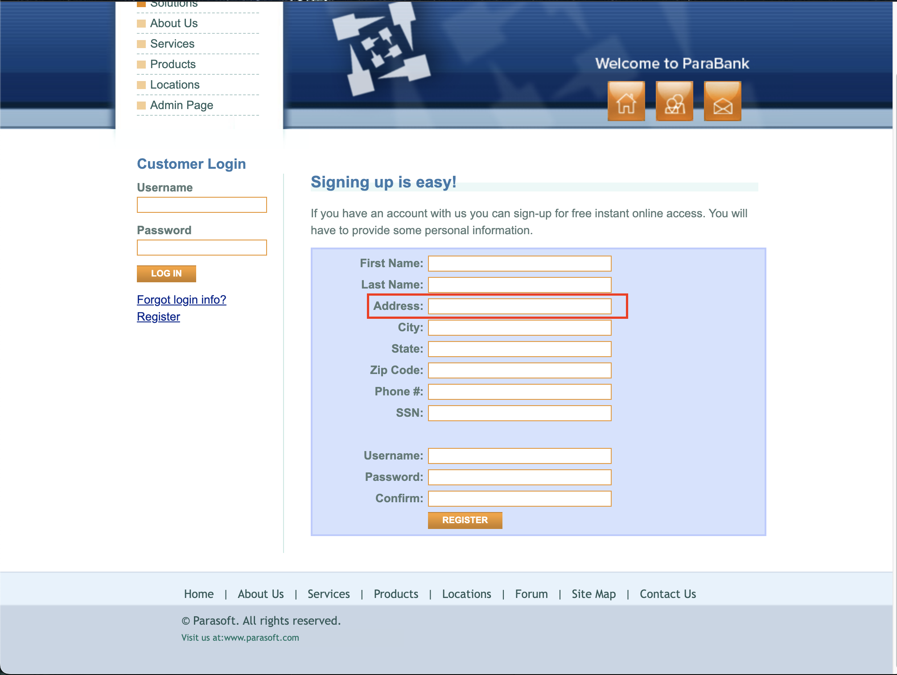

<body>
    <h1>Bug Report – Missing Validation in Address Field</h1>
    <h2>Description</h2>
    
The <strong>Address</strong> field in the registration form does not enforce proper input validation, allowing users to enter invalid characters or excessively long inputs.

    <h2>Affected Page</h2>
    <ul>
        <li><a href="https://parabank.parasoft.com/parabank/register.htm">Registration Page</a></li>
    </ul>
    <h2>Steps to Reproduce</h2>
    <ol>
        <li>Navigate to the <a href="https://parabank.parasoft.com/parabank/register.htm">Registration Page</a>.</li>
        <li>Enter an invalid address, such as <strong>"!@#$%^&*()"</strong> or an excessively long string (e.g., 500+ characters).</li>
        <li>Click the <strong>REGISTER</strong> button.</li>
        <li>The system does not display any validation error and accepts the invalid input.</li>
    </ol>
    <h2>Screenshot</h2>
    

    <h2>Expected Behavior</h2>
    <ul>
        <li>The Address field should only accept valid <strong>alphanumeric characters</strong>, spaces, and common address symbols (e.g., <strong>"#", "-", "."</strong>).</li>
        <li>Special characters like <strong>"!@#$%^&*()"</strong> should be restricted.</li>
        <li>There should be a reasonable <strong>character limit</strong> to prevent excessively long inputs.</li>
        <li>If invalid characters are entered, the system should display an <strong>error message</strong>.</li>
    </ul>
    <h2>Suggested Fix</h2>
    <ul>
        <li>Implement validation to allow only <strong>valid address formats</strong>.</li>
        <li>Restrict special characters that are not typically used in addresses.</li>
        <li>Apply a <strong>character limit</strong> (e.g., <strong>100-150 characters max</strong>).</li>
        <li>Ensure validation is applied <strong>both on the frontend and backend</strong>.</li>
    </ul>
    <h2>Test Environment</h2>
    <ul>
        <li>OS: macOS</li>
        <li>Browser: Google Chrome 134.0.6998.44</li>
    </ul>
</body>