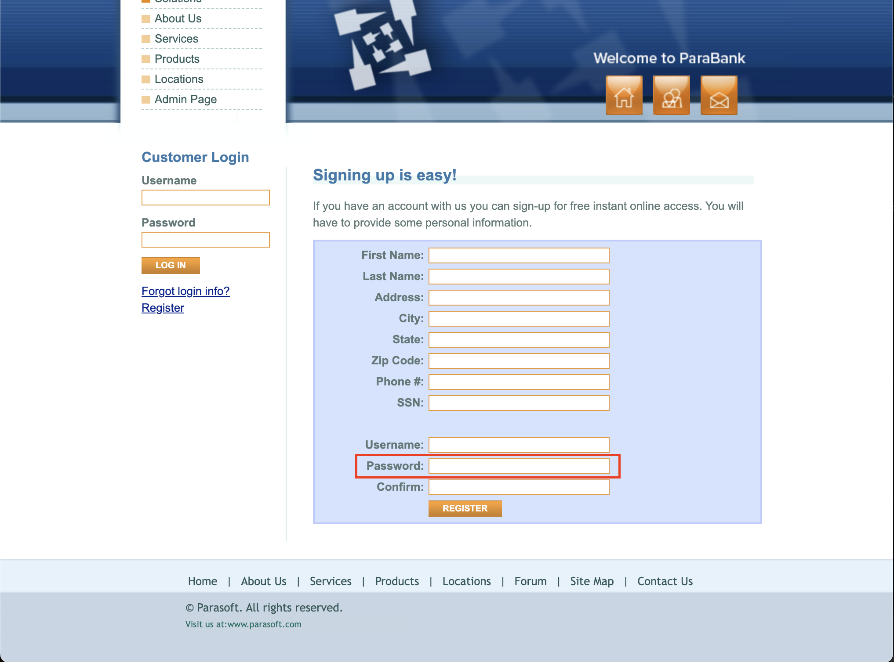

<body>
    <h1>Bug Report – Missing Validation in Password Field</h1>
    <h2>Description</h2>
    
The <strong>Password</strong> field in the registration form does not enforce any strength requirements, allowing users to set weak passwords that could compromise account security.

    <h2>Affected Page</h2>
    <ul>
        <li><a href="https://parabank.parasoft.com/parabank/register.htm">Registration Page</a></li>
    </ul>

    <h2>Steps to Reproduce</h2>
    <ol>
        <li>Navigate to the <a href="https://parabank.parasoft.com/parabank/register.htm">Registration Page</a>.</li>
        <li>Enter a weak password, such as <strong>"12345"</strong>, <strong>"password"</strong>, or <strong>"abcd"</strong>.</li>
        <li>Click the <strong>REGISTER</strong> button.</li>
        <li>The system accepts the weak password without any warning or error message.</li>
    </ol>
    <h2>Screenshot</h2>
    

    <h2>Expected Behavior</h2>
    <ul>
        <li>The system should require <strong>strong passwords</strong>, meeting at least the following criteria:</li>
        <ul>
            <li>Minimum <strong>8 characters</strong></li>
            <li>At least <strong>one uppercase letter</strong></li>
            <li>At least <strong>one number</strong></li>
            <li>At least <strong>one special character</strong> (e.g., <strong>"!@#$%^&*()"</strong>)</li>
        </ul>
        <li>Weak passwords should be rejected with an appropriate <strong>error message</strong>.</li>
    </ul>
    <h2>Suggested Fix</h2>
    <ul>
        <li>Implement a <strong>password policy</strong> enforcing a strong password format.</li>
        <li>Provide a <strong>password strength indicator</strong> to guide users.</li>
        <li>Enforce password validation <strong>both on the frontend and backend</strong>.</li>
    </ul>
    <h2>Test Environment</h2>
    <ul>
        <li>OS: macOS</li>
        <li>Browser: Google Chrome 134.0.6998.44</li>
    </ul>
</body>