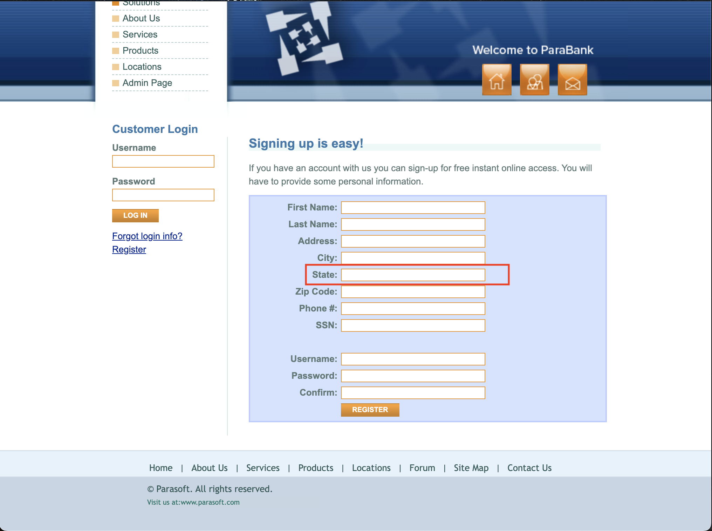

<body>
    <h1>Bug Report – Missing Validation in State Field</h1>
    <h2>Description</h2>
    
The <strong>State</strong> field in the registration form does not enforce proper input validation, allowing users to enter invalid characters, numbers, or incorrect formats.

    <h2>Affected Page</h2>
    <ul>
        <li><a href="https://parabank.parasoft.com/parabank/register.htm">Registration Page</a></li>
    </ul>
    <h2>Steps to Reproduce</h2>
    <ol>
        <li>Navigate to the <a href="https://parabank.parasoft.com/parabank/register.htm">Registration Page</a>.</li>
        <li>Enter an invalid state name, such as <strong>"California123"</strong>, <strong>"!!StateName!!"</strong>, or <strong>"A very long state name exceeding standard length"</strong>.</li>
        <li>Click the <strong>REGISTER</strong> button.</li>
        <li>The system does not display any validation error and accepts the invalid input.</li>
    </ol>
    <h2>Screenshot</h2>
    

    <h2>Expected Behavior</h2>
    <ul>
        <li>The State field should only accept <strong>alphabetical characters and spaces</strong>.</li>
        <li>Special characters (e.g., <strong>"!@#$%^&*()"</strong>) and numbers should be <strong>restricted</strong>.</li>
        <li>There should be a reasonable <strong>character limit</strong> to prevent excessively long inputs.</li>
        <li>If invalid characters are entered, the system should display an <strong>error message</strong>.</li>
    </ul>
    <h2>Suggested Fix</h2>
    <ul>
        <li>Implement validation to allow only <strong>letters and spaces</strong>.</li>
        <li>Restrict <strong>special characters and numbers</strong>.</li>
        <li>Apply a <strong>character limit</strong> (e.g., <strong>50 characters max</strong>).</li>
        <li>Ensure validation is applied <strong>both on the frontend and backend</strong>.</li>
    </ul>
    <h2>Test Environment</h2>
    <ul>
        <li>OS: macOS</li>
        <li>Browser: Google Chrome 134.0.6998.44</li>
    </ul>
</body>