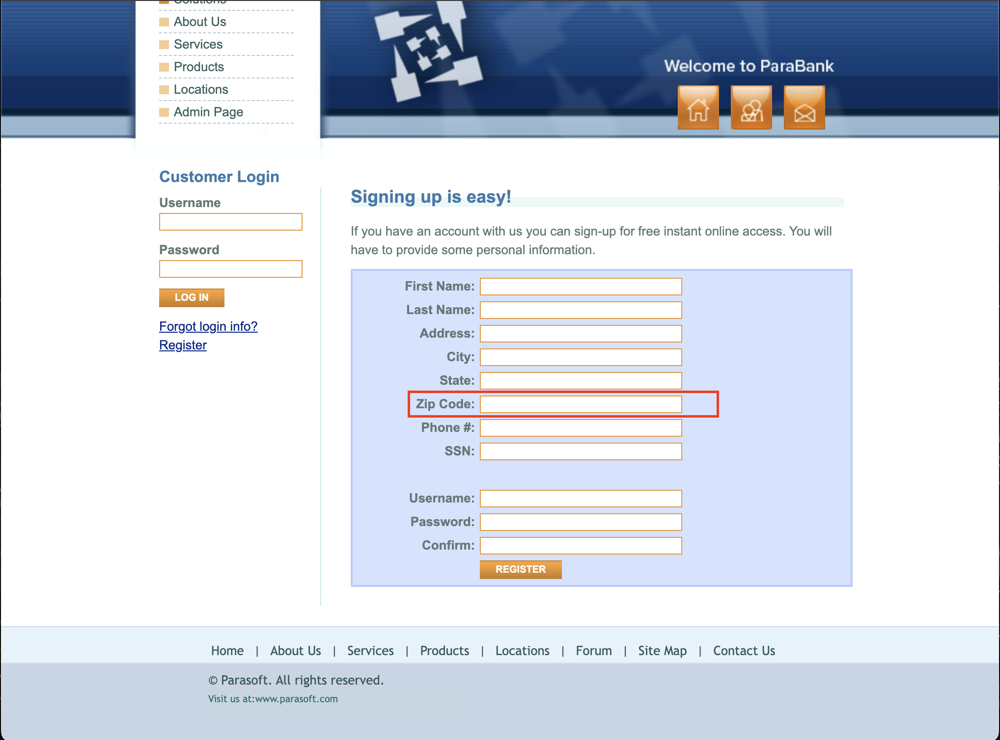

<body>
    <h1>Bug Report – Missing Validation in Zip Code Field</h1>
    <h2>Description</h2>
    
The <strong>Zip Code</strong> field in the registration form does not enforce proper input validation, allowing users to enter invalid characters, letters, or incorrect formats.

    <h2>Affected Page</h2>
    <ul>
        <li><a href="https://parabank.parasoft.com/parabank/register.htm">Registration Page</a></li>
    </ul>
    <h2>Steps to Reproduce</h2>
    <ol>
        <li>Navigate to the <a href="https://parabank.parasoft.com/parabank/register.htm">Registration Page</a>.</li>
        <li>Enter an invalid zip code, such as <strong>"AB123"</strong>, <strong>"12-34!X"</strong>, or an excessively long zip code.</li>
        <li>Click the <strong>REGISTER</strong> button.</li>
        <li>The system does not display any validation error and accepts the invalid input.</li>
    </ol>
    <h2>Screenshot</h2>
    

    <h2>Expected Behavior</h2>
    <ul>
        <li>The Zip Code field should only accept <strong>numeric values</strong>.</li>
        <li>Letters and special characters (e.g., <strong>"!@#$%^&*()"</strong>) should be <strong>restricted</strong>.</li>
        <li>The system should enforce a proper zip code format (e.g., <strong>"XXXXX"</strong> or <strong>"XXXXX-XXXX"</strong> for U.S. zip codes).</li>
        <li>If an invalid zip code is entered, the system should display an <strong>error message</strong>.</li>
    </ul>
    <h2>Suggested Fix</h2>
    <ul>
        <li>Implement validation to allow only <strong>digits</strong> (0-9).</li>
        <li>Enforce proper zip code formats (e.g., <strong>"XXXXX"</strong> or <strong>"XXXXX-XXXX"</strong>).</li>
        <li>Apply a <strong>character limit</strong> to prevent excessively long inputs.</li>
        <li>Ensure validation is applied <strong>both on the frontend and backend</strong>.</li>
    </ul>
    <h2>Test Environment</h2>
    <ul>
        <li>OS: macOS</li>
        <li>Browser: Google Chrome 134.0.6998.44</li>
    </ul>
</body>